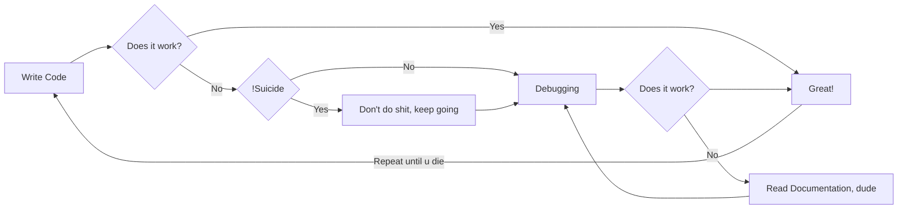

## Learning Flow

```mermaid
graph LR
    A[Write Code] --> B{Does it work?}
    B -- Yes --> C[Great!]
    B -- No --> D{!Suicide}
    C -- Repeat until u die --> A
    D -- No --> E[AWD]
    D -- Yes --> F[Don't do shit, keep going] --> E[Debugging]
    E --> G{Does it work?}
    G -- No --> H[Read Documentation, dude] --> E
    G --> C
```
